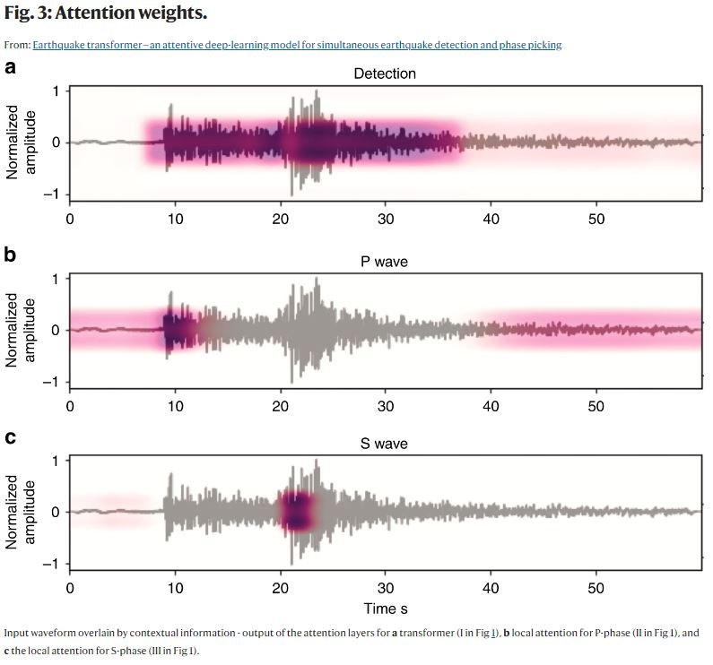

# Seismic Detection Across the Solar System

NASA Space Apps 2024 entry from team [Seismic Surge](https://www.spaceappschallenge.org/nasa-space-apps-2024/find-a-team/seismic-surge/).

## Loading Space Apps Data

Data for this challenge can be found at the NASA Space App Challenge Page [Seismic Detection Across the Solar System](https://www.spaceappschallenge.org/nasa-space-apps-2024/challenges/seismic-detection-across-the-solar-system/?tab=resources). 
Click on the Space Apps 2024 Seismic Detection Data Packet to download the data and demo notebook as a zipped folder. Due to the size of the 
data directory, it is missing from this repository as it is included in the gitignore. The data can be set up in a local or Google Colab 
environment with the steps below.

### Local Environment
Once you have downloaded the data packet and unzipped the folder, the data directory can be copied into the main directory for this 
cloned repository to be used locally.

### Colab Environment

To access the data through a shared Google Colab notebook, the project repository can be uploaded to a shared Google drive and then 
mounted to the notebook using the code below. This is utilized in the `nasa2024_colab_notebook.ipynb`.

```python
from google.colab import drive
drive.mount('/content/drive')
```

```python
%cd /content/drive/My Drive/space_apps_2024_seismic_detection
```

## Installing Dependencies

With your environment ready, you can install the dependencies by running the following command from your terminal:
`pip install -r requirements.txt`

## Extracting Data

To simplify working with the data, we've created python scripts to extract data in bulk from data sets of interest, 
and perform data cleaning/transformations as needed. There are two separate scripts, each for working with the csv and 
miniseed data. Each script can be found in the `scripts` directory.

### CSV Data
The `extract_csv.py` script can be used to extract and returned the desired csv data as a single pandas DataFrame. The extract_data 
function within this script loops through the data sets of interest and concatenates them together while performing data cleaning and 
transformations as needed. Each data set of interest can be obtained with the code below:

```python
import extract_csv

lunar_train = extract_csv.extract_data('lunar', 'train', 'csv')
lunar_catalog = extract_csv.extract_data('lunar', 'catalog', 'csv')
lunar_test = extract_csv.extract_data('lunar', 'test', 'csv')
mars_train = extract_csv.extract_data('mars', 'train', 'csv')
mars_catalog = extract_csv.extract_data('mars', 'catalog', 'csv')
mars_test = extract_csv.extract_data('mars', 'test', 'csv')
```

### Miniseed Data

The `extract_mseed.py` script can be used to extract and returned the desired miniseed data as a list of ObsPy streams. 
This can be done by executing the follwoing commands. Currently it is only set up for returning the mars training data.

```python
import extract_mseed
data = extract_mseed.extract_mseed()
```

## Interpreting Data

### Lunar Seismic Data

The `lunar_model_notebook.ipynb` implements a machine learning model to distinguish between seismic events and noise in lunar mission data. By filtering out noise and identifying significant seismic activity, the model intends to ensure that only valuable data is transmitted back to Earth from lunar detection devices.

* Objective: Automatically detect and differentiate seismic events from noise in lunar seismic data to optimize data transmission.
* Data Source: Seismic data collected from lunar missions, stored in CSV files containing time and velocity measurements.
* Model Architecture: An LSTM (Long Short-Term Memory) autoencoder designed for time series anomaly detection.

#### Customization
* Hyperparameters:
Adjust sequence_length to change the size of data sequences.
Modify epochs and batch_size for training.
Set a custom anomaly detection threshold based on your data.
* Model Architecture:
Alter the number of LSTM layers or units to optimize performance.

### Mars Seismic Data
 
The `mars_demo_notebook.ipynb` takes the lunar `demo_notebook.ipynb` and adapts the code to be capable of handling data in the mars files, 
such as accounting for differences between file structures and frequencies measured.
* Bandpass - a function in obspy that helps with filtering data. In this case it filters out data between the min and max frequencies given.
* Highpass - similar to bandpass but handles frequencies above 10 hz, which is bandpass cap. this is the one mars data uses to filter, but the 
notebook will recognize that bandpass can't handle it and automatically shift to highpass. frequencies above the specified frequency are 
allowed through.
* Lowpass - frequencies below the given frequency are  allowed to come through.

## Model Development

There are many different options for model development, such as pre-built neural networks for earthquake detection, event detection, or 
even designing a model from scratch.

### Pre-Built Models

#### EQTransformer

There is a python package, [EQTransformer](https://github.com/smousavi05/EQTransformer), for signal detection and phase picking using AI 
(Tensorflow). This model is an intriguing option as it is tuned for earthquake detection. As noted in their paper, [Earthquake transformer—an attentive deep-learning model for simultaneous earthquake detection and phase picking](https://www.nature.com/articles/s41467-020-17591-w),
phase picking refers to measuring the arrival time of the seismic P and S wave phases. These phases are useful for estimating the location 
of the seismic activity. This could allow for more accuracy when it comes to the start and stop times of such seismic events, or for 
using either P or S wave to determine the general time of an event. Both the P and S waves can be seen in the image below from their paper.



When working to install the package, we kept running into a ModuleNotFoundError: No mudle named 'distutils.msvcompiler'. Further documentation 
for EQTransformer can be found at [EQTransformer Docs](https://eqtransformer.readthedocs.io/en/latest/index.html).

#### EventDetector

[EventDetector](https://github.com/menouarazib/eventdetector) is a Python library for deep learning-based event detection in multivariate time 
series data which utilizes TensorFlow. More information regarding their model design can be found in their paper [Universal Event Detection in Time Series](https://osf.io/preprints/osf/uabjg).

### Custom Models

When it comes to designing a model from scratch, the purpose of an event detection model is to focus on change point detection (CPD) as noted 
in the paper [A survey of methods for time series change point detection](https://link.springer.com/article/10.1007/s10115-016-0987-z). This 
refers to the problem of finding abrupt changes in data over a change of time. In the case of seismic detection, the abrupt change being 
velocity registered by the seismic instruments.

As discussed in `demo_notebook.ipynb` an approach of assessing the short term average to long term average (STA/LTA) can be used for this 
change point detection.

### Resources
Discord 
    https://discord.com/

NASA Spaceapps Challenge 
    https://www.spaceappschallenge.org/nasa-space-apps-2024/find-a-team/seismic-surge/?tab=project

ChatGPT 
    https://openai.com/chatgpt/

VS Code 
    https://code.visualstudio.com/

Google CoLab  
    https://colab.research.google.com/

Google Gemini  
    https://gemini.google.com/app

ObsPy 
    https://docs.obspy.org/

EQTransformer 
    https://github.com/smousavi05/EQTransformer

EventDetector 
    https://github.com/menouarazib/eventdetector

Codeium 
    https://codeium.com/
    
A survey of methods for time series change point detection 
    https://link.springer.com/article/10.1007/s10115-016-0987-z

